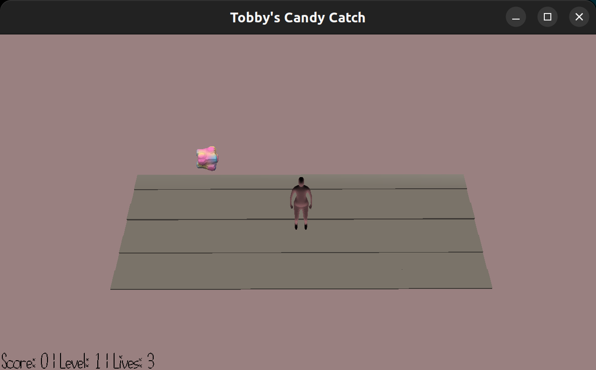

# Tobby's Candy Catch

Author: Jiyoon Park

Design: In this game, Tobby's mission is to collect flying candy, but there's a twist! The candy makes a sound and flies in a straight line along the x-axis, but it remains invisible until it gets close to Tobby. Players must rely on their keen sense of hearing and quick reflexes to move Tobby to the right location and catch the candy before it's too late.

Screen Shot:

## How To Play:

Your goal is to move **Tobby** to where the candy flies to. You have three lives to start with, and will lose a life if you miss a candy.

## Rules:

- You can only use the up, down, right, left arrows, and space bar to move Tobby.

### HotKey

- **up, down, right, left** : Moves Tobby.
- **space** : Tobby jumps.

## For a better gaming experience, please use your headphones!

This game was built with [NEST](NEST.md).
